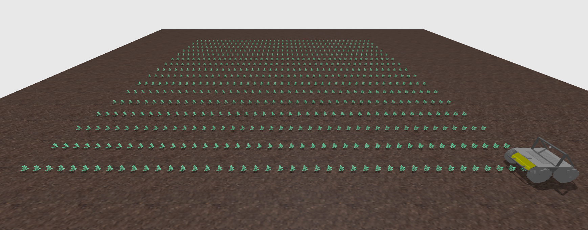
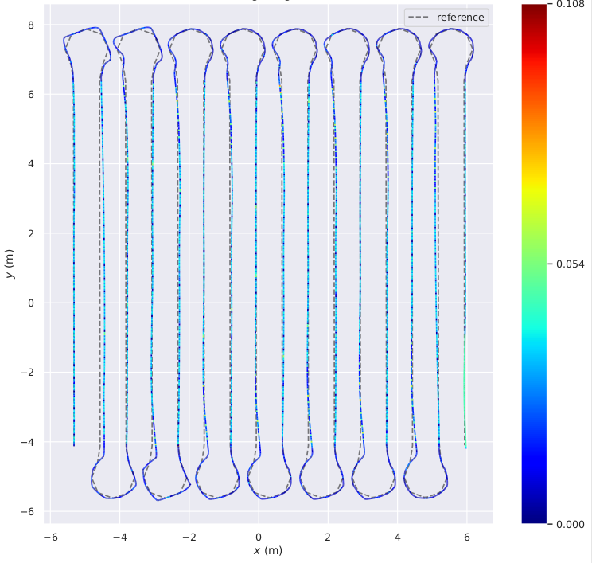

# Field_LFNV — Linear Field Navigation for Agricultural Robotics  
*ROS 2 Humble · Ignition Gazebo Fortress · Clearpath Husky*

---

## Overview
**Field_LFNV** implements a complete **linear-field navigation pipeline** for the Clearpath Husky A200.  
It integrates **crop-path perception**, **reference-path generation**, **nonlinear MPC trajectory tracking**,  
and a **finite-state row manager** to demonstrate robust autonomous navigation in structured agricultural fields.

This repository contains **only custom simulation assets and ROS 2 nodes**.  
Vendor-provided Husky models and meshes from `clearpath_gz` are referenced at runtime and **not re-distributed**.

<p align="center">
  
  
</p>

*Left:* Ignition Gazebo linear-field world with crop rows and Husky robot.  
*Right:* MPC trajectory tracking (color = lateral error in meters).

---


## Requires
- ROS 2 **Humble** (source): `source /opt/ros/humble/setup.bash`
- **Ignition Gazebo Fortress** (`ign gazebo` on PATH)
- **Clearpath Husky simulation**: `sudo apt install ros-humble-husky-simulator`
- Python deps: `python3-opencv python3-numpy` (plus any you import)

> Vendor models/worlds from `clearpath_gz` are **not copied** here. We reference them via `model://…`.
> Add Clearpath’s share path to Ignition’s resource path (Fortress):
```bash
export IGN_GAZEBO_RESOURCE_PATH="$IGN_GAZEBO_RESOURCE_PATH:$(ros2 pkg prefix clearpath_gz)/share"
